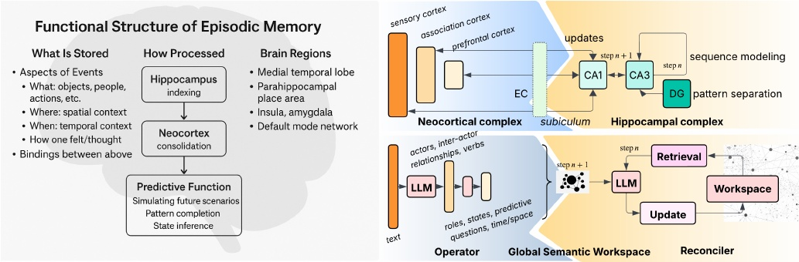

Figure 1: Unifying Brain-Inspired and Generative Semantics for Episodic Memory Modeling The hippocampal complex (DG, CA3, CA1) and neocortical regions (NC) inspire the Reconciler (retrieval, workspace, update) and Operator (LLM-driven semantic role extraction), respectively. The neocortical complex, responsible for context-rich consolidation and predictive modeling, aligns with the Operator module's functions. The hippocampal complex, which performs indexing, pattern separation, and sequence modeling, corresponds to the Reconciler. Together, the GSW framework offers a biologically inspired, interpretable model for simulating world knowledge from text inputs.

internal models (Ólafsdóttir, Bush, and Barry 2018; Louie and Wilson 2001; Wilson and McNaughton 1994). This back and forth supports both persistence and prediction of memory (McClelland, McNaughton, and O'Reilly 1995; Rasch and Born 2013), key features of episodic memory.

Motivated by this biological architecture (see Fig 1), an effective memory framework requires a structured representation capable of encoding actors along with their evolving roles and states. Crucially, this representation must be capable of spatiotemporal grounding, linking entities and their interactions to specific times and locations, much like the binding function of the hippocampus. Finally, the framework must possess a process for consolidating and updating these structures as new information arrives, mirroring the way the neocortical-hippocampal loop constantly refines its world model. This process of building an evolving model is illustrated with a detailed end-to-end example in Appendix B.

From Episodic Memory to Generative Modeling of Situations and Narratives: The central challenge, therefore, is to create a continuously evolving semantic model, which requires a bidirectional mapping between text and a structured representation. While early symbolic frameworks like PropBank (Kingsbury and Palmer 2002) and FrameNet (Baker, Fillmore, and Lowe 1998) attempted this, they were not designed for this full bidirectional process, relying instead on fixed ontologies that lacked the necessary probabilistic and dynamic interpretation.

LLMs now make this bidirectional mapping tractable. They can both infer concise semantic identifiers from text and generate coherent narratives from those identifiers. This enables a new, efficient memory model where compact semantic traces are stored and reactivated in context. The formal model is presented next, and its approach is validated in Appendix I, where a human evaluation shows a strong preference for the GSW semantic maps over those from frameworks like PropBank and FrameNet.

## A Probabilistic Model for Semantic Memory: The Operator Framework

We now define a minimal schema for encoding these semantic elements—along with predictive cues, spatiotemporal attributes, and utilities—that serves as the foundation of the GSW framework for structured memory in LLMs. The agent must distill and maintain a semantic map from text to build a coherent semantic model.

To make this concrete, let's consider a single text input  $ C_{n} $  at some time step n: Yesterday, in a swift response to a reported robbery, law enforcement officers apprehended Jonathan Miller, a 32-year-old resident of Greenview Avenue, in the downtown area.

Explicit information in  $ C_{n} $  typically specifies a configuration of participating actors  $ a_{1},\ldots,a_{K} $  and the relations or interactions among them. The agent must distill and maintain a semantic map from these clues to build a coherent semantic model. Let's represent this interaction pattern at time step n as (here each entry denotes an interaction from actor  $ a_{i} $  to  $ a_{j} $  as inferred from  $ C_{n} $ ):

 $$ \mathcal{C}_{n}\approx\begin{pmatrix}(a_{1}\rightarrow a_{1})^{n}&\cdots&(a_{1}\rightarrow a_{K})^{n}\\\vdots&\ddots&\vdots\ $ a_{K}\rightarrow a_{1})^{n}&\cdots&(a_{K}\rightarrow a_{K})^{n}\end{pmatrix}; $$ 

## Actors, Roles and States

The word ‘Miller’, in isolation, corresponds to a broad, unconditioned distribution over possible behaviors of a human. If ‘Miller’ is likely to commit a crime, the agent would probably refer to Miller with a label ‘Criminal’. We call these labels roles.

Role: An identifier that specifies a distribution over potential actions that an actor  $ a_{i} \in A $  may take toward other actors  $ a_{j} \in A $ :

 $$ \pi_{r}:\mathcal{A}\times\mathcal{A}\rightarrow[0,1] $$ 

where $\pi_{r}(a_{i} \rightarrow a_{j})$ denotes the probability of $a_{i}$ acting on $a_{j}$ in role $r$. For example, assigning the role of ‘criminal’